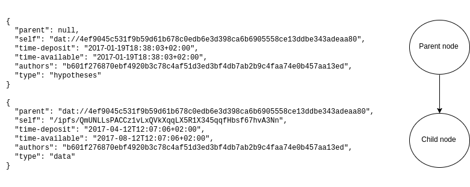

__For the 2017 IFLA conference, theme: Being open about open__

__Made available under a [CC 0 public domain dedication](https://creativecommons.org/publicdomain/zero/1.0/legalcode)__

## Abstract

Scholarly communication is in need of disruption. Commodifying knowledge as is currently done with journals, is not sustainable any longer. An alternative is the commodification of how information is consumed. By focusing on the commodification of consumption instead of commodification of the resource, the problem of access to knowledge can be resolved in a sustainable manner. Additionally, commodification of consumption removes several perverse incentives from the scholarly system that now produces unreliable knowledge. The main tenet underlying the themes of Open Access, Open Data, Open Science, and replication initiatives in scholarly communication is sustainability through transparency of the scholarly process in all facets. The sustainability of any networked system is threatened by single points of failure (i.e., the entire system can be manipulated from one node in the network). The scholarly process is ridden with such single points of failures at all stages. Distributing the scholarly communications system would remove the problems of single points of failure. Distributing and decentralizing the scholarly communications system is achievable with newly developed peer-to-peer (p2p) Internet protocols. Alongside decentralization and distribution of the content, integrity of the scholarly record can also be reformed to transform sections of a paper into different, reusable nodes of knowledge. These nodes can be logged on a blockchain based ledger of which everyone can have a copy. In order to deposit nodes onto the ledger, the depositor needs to agree that the contents are licensed CC 0, in order to maximize legal certainty regarding reuse of the contents. This is key to create a sustainable eco-system where scholars and companies can cooperate instead of compete, as we currently do.

## Body

Scholarly communication is in (dire) need of disruption. Subscription costs to scholarly journals are untenable already [e.g., @harvard-serials-crisis] and will become even more untenable in the long run with above inflation price-increases [i.e., serials crisis; @serials-crisis]. The current scholarly incentive system detracts validity instead of adding it [e.g., @10.1371/journal.pmed.0020124;@10.1371/journal.pmed.0050201] by promoting behavior that is antithetical to the norms of science [@merton1942;@10.2307/2094423;@10.1525/jer.2007.2.4.3]. For example, results particular to one researcher instead of universal among researchers, because results cannot systematically be verified considering data are rarely shared [@10.1038/nature.2017.21549;@10.1525/collabra.13;@10.1037/0003-066x.61.7.726] or preserved [@10.1016/j.cub.2013.11.014]. Widely publicized results regularly fail reproducibility tests [e.g., @10.1126/science.aac4716;@10.1038/483531a;@10.1038/541269a; but see also @10.1016/j.jesp.2015.10.001], in part because published results are highly pre-selected for unscientific reasons [e.g., pure novelty of results, @10.1016/j.tree.2013.05.007; easy to assimilate findings, @10.1038/526182a; statistical significance, @10.1126/science.1255484;@10.1016/0140-67369190201-Y]. These problems are not new but they are also not absolute --- scholars want to behave in accordance with the scientific norms [@10.1525/jer.2007.2.4.3] but the system seems to encourage us to do the opposite.

In this perspective piece, I try to radically reimagine the scholarly communications infrastructure based on the digital tools that are available to us now, instead of the analog era and its legacies. I thoroughly believe that the Mertonian norms in science [@merton1942] align perfectly with transparency in science [see also @10.14293/s2199-1006.1.sor-socsci.arysbi.v1] and that a scholarly communications system can be built on this framework in a sustainable manner. I invite everyone to criticize these ideas, for only with diversity of ideas can we truly make progress. Currently, how scholars operate (i.e., governance) is driven by a few oligopolies [@10.1371/journal.pone.0127502] or the highly pre-selected sample of tenured professors and policymakers, who mostly stem from the generation that has created this broken system and have benefited or still benefit from the current system. As a result, they are likely to underestimate the need for change in scholarly communications and cannot be expected to intervene in the necessary ways.

In the last decades, interpersonal communication has changed tremendously. Not only has it brought much diversity in communication, so much diversity has come into existence that it has become confusing (see Figure 1). At the same time, that same diversity has liberated us by allowing innovative ways to communicate (e.g., social media) or making available previously difficult to use safety measures easily accessible to the masses (e.g., encryption). Diversity in communication-channels has thus spawned new ways of communicating.

```{r xkcd-1810, fig.cap="_Figure 1._ A comical example of the diversity in communication channels. [Licensed under CC BY-NC 2.5 from xkcd](https://xkcd.com/1810/)", out.width="60%", fig.align="center", echo = FALSE}
knitr::include_graphics('figs/xkcd_1810-cc-by-nc-2_5.png', auto_pdf = TRUE)
```

The current scholarly communications system requires submitting to a journal that fits all scholarly output into a static, page-by-page, and paper format without the innovative solutions that are now available. This bottleneck not only prevents new ways of communicating findings, it also prevents further encouragement of discussion amongst readers about the findings. As a result, the current system encourages scholars to passively consume findings instead of critically evaluating them.

Hence, we are stuck in a paper paradigm, albeit writing digital pages. Such digital pages radically restrict the way we imagine the communication of our results. In recent years, options to break free from this paper paradigm have arisen with tools such as [Rmarkdown](http://rmarkdown.rstudio.com/) or [Jupyter notebooks](https://jupyter.org/). These options allow the user to include code to dynamically generate figures, tables, or values in the text. By extension, how data are cleaned and analyzed can also be included as part of a manuscript for co-authors to verify or readers to discuss [see also @elife-rmd]. Moreover, interactive elements can be embedded, such as interactive figures, online applications, or videos. 

The scholarly process is much more complicated than can be captured in a single static and retrospective publication. The previously mentioned interactive elements enrich a single publication, but multiple moments of communicating ideas and results maps the empirical cycle onto the communication process. For example, a quantitative scholar needs to develop methods to investigate a research question. Feedback from peers would be valuable at that point. With so called Registered Reports [@10.1016/j.cortex.2012.12.016] a two-staged submission process is introduced to move away from a single static publication. It allows selected peers (i.e., peer reviewers) to discuss the contents at an interim stage. Additionally, this ensures chronology of predictions such as pre-registrations aim to do [@10.1038/s41562-016-0021], but in a more natural way. Nonetheless, registered reports, pre-registration, and data sharing are for the proactive, hence, remain the exception rather than the norm [@10.1371/journal.pbio.1002456], while these are already implicitly part of how scholarly research is conducted. Additionally, researchers create materials, protocols, and other outputs during the research process, share them with colleagues/advisors, but this process is not (aptly) sharable in a static publication. If the scholarly research process has more moments of communication, these implicit parts are finally able to show themselves. 

Additionally, the scholarly process has grown more complicated with the rise of research tools available and the speed with which alternative results can be inspected. Point-and-click software has increased the number of statistical analyses a researcher can do within minutes. This increased researcher degrees of freedom to present results that are more in line with previous results, leading to confirmation bias or motivated reasoning [@10.1037/0033-2909.108.3.480], hence, invalid results [@10.1177/0956797611417632]. Moreover, the development of technology has created new types of data output that greatly exceed human comprehension and require algorithms before being able to make sense of the data (e.g., fMRI data). How a researcher applies all these tools is essential, but the current scholarly communication system does not require communication of the details needed to understand what steps were taken. Lack of direct reproducibility of results [e.g., @10.1101/056473] therefore is no surprise when we do not know how data are processed and analyzed. As such, the scholarly process has become more of a black box than it was before because communication has not adapted proportionate to the increasing complexity of the message that needs to be communicated. Increasing complexity and lack of transparency makes it increasingly difficult to reproduce steps taken, simply due to an increasing garden of forking paths [@10.1511/2014.111.460]. 

<!-- Moreover, much of the software is proprietary and it is simply impossible to verify results or understand how they originated [@10.1038/nature10836]. Trying to reverse engineer these pieces of software is actually often illegal based on the terms of service agreement that you have to accept before using the software. As such, it is practically impossible to understand how software development affects how results are computed, while testing for this is easy with open-source software. -->

Due to the fact that these complexities currently cannot and therefore are not reported, breaking the reign of the paper paradigm is a necessity to better represent and understand how scholarly results come into existence. Static paper publication remains a valid communication medium and it is not made obsolete when scholarly communications become truly digitally born and continuous. PDF versions of outputs can still be produced if a paper format is suitable or desirable. However, it is easy to imagine videos being embedded for protocols to be easily clarified (having "Video X" alongside "Figure X" and "Table X", for example) by origin, to then be replaced by stills when a paper version is produced. Nonetheless, without shifting the main focus from paper-based to digital-based scholarly communication, we cannot break free from the legacies of the paper paradigm. Paper-based communication includes the legacy of printing research outputs by default, which by extension includes the idea of subscriptions, purchasing content, and restricting the flow of information. Copyright is the legacy of the paper-based age that seems to limit the digital potential of scholarly outputs. As such, the legacy of a paper-based paradigm with respect to scholarly communication is that of knowledge commodification.

For scholarly communication, commodifying knowledge as it is currently done can be seen as a human rights violation. [The Universal Declaration of Human Rights (UDHR), Article 27 section 1](http://wayback.archive.org/web/20170510094028/http://www.un.org/en/universal-declaration-human-rights/index.html), reads as follows

> Everyone has the right freely to participate in the cultural life of the community, to enjoy the arts and to share in scientific advancement and its benefits.

When knowledge is commodified, it results in decreased participation, enjoyment, and sharing of scholarly progress. It could therefore be argued that this is a violation of human rights [@udhr]. Moreover, this is the main legal motivation proposed by Alexandra Elbakyan as to why [Sci-Hub](http://sci-hub.bz) is not illegal from her point of view [@alexandraelbakyan]. Discussion on the legal correctness of this argument would be worthwhile to further learn about this. On the other hand, legal cases on this could result in clarification of whether unauthorized sharing, which is part of scholarly culture [@10.1038/545145a], is allowed from a human rights perspective and whether such sharing would supercede copyright legislation.

Moreover, commodifying knowledge is not the only way to make scholarly communication sustainable; an alternative is the commodification of how information is consumed. That is, commodifying the services that serve the users the content, instead of the content itself. For example, if all scholarly information is freely available, (not-)for-profit organizations can compete for users who want to sift through that information efficiently. If an algorithm is developed that greatly increases efficiency of finding relevant articles, revenue could be built with usage fees to that service instead of the content. Such a market could create competition in information consumption, which is timely given the information explosion humanity is going through at the moment. The potential market capitalization of free flow of information and data is tremendous [e.g., freely reusable public sector information/data in the U.K. is estimated to provide a market cap of £590 million - £16 billion; p. 96 of @dotecon]. A freely reusable information resource would provide the infrastructure that encourages innovation and competition as to how people can discover and consume that information. 

Consequently, by focusing on the commodification of consumption instead of commodification of the resource, the problem of access to knowledge can be resolved in a sustainable manner. When the consumption is commodified, all service providers benefit from creating the largest pool of resources that is freely available to build their service on. By extension, it shifts the optimal outcome from not sharing (i.e., defecting) to sharing (i.e., cooperating), because it increases the value of their service. This would create a market that stimulates access instead of limiting it, while retaining the potential for revenue.

Additionally, commodification of consumption removes several perverse incentives from the scholarly system that now produces unreliable knowledge. For example, innovativeness and surprisingness are criteria upon which articles are currently selected, where those exact some properties increase the probability that the finding is false [@10.1371/journal.pmed.0020124]. When the knowledge is commodified, this makes sense from a business perspective (comparable to news outlets): readers will buy access more to shocking and astounding results. However, when consumption is commodified, this whole incentive is removed and the most valuable resource is the most populated and diverse one. This would allow much more information to be extracted, hence, richer services to be built on top of that resource.

The main tenet underlying the themes of Open Access, Open Data, Open Science, and replication initiatives in scholarly communication is sustainability through transparency of the scholarly process in all facets. As I tried to explain in the previous paragraphs, this sustainability can be achieved by recalibrating the fundamental business model of the scholarly communications system. In the next section of this perspective piece, I propose a redesign of the scholarly communication system that is flexible, decentralized, distributed, and freely accessible and reusable from the start. Such a system would allow for more sustainability and diversity in the way we consume, produce, and access knowledge, which would ultimately benefit everyone who reaps the benefits of scholarly results. 

## Sustainable scholarly communication

The sustainability of any networked system is threatened by single points of failure (i.e., the entire system can be manipulated from one node in the network). Single points of failure not only make a system vulnerable to downtime, it also raises the possibility of (malicious) adjustment of content, or even complete removal of content (among other things). For example, retracted papers sometimes wholly disappear, leaving only the retraction notice; this results in a direct and nearly irreversable adjustment of the scholarly record (from the scholar's perspective). Due to these single (or few) points of failure, such a centralized and concentrated infrastructure is easier to disrupt than a decentralized or distributed one [see also @10.1103/physreve.95.022313]. 

The scholarly process is ridden with single- or few points of failures at all stages. Hence its sustainability is directly threatened. As mentioned before, communication occurs only once (i.e., at the end); this could be regarded as a single point of failure for communicating what the scholars did. If data are not shared or preserved, the scholar creates a single point of failure in accessing and preserving the data. When results are published with a closed access publisher, the publisher becomes the single point of failure for providing access to those results. For exactly this reason I find it important that scholars become more transparent about their data, their hypotheses, their results, and the chronology of their research process; it decreases the risk of a single point of failure actually failing.

Distributing the scholarly communications system would remove the problems of single- or few points of failure in access to findings. Currently, [Portico](http://www.portico.org/digital-preservation/) and [CLOCKSS](https://clockss.org/clockss/Home) are supposed to provide access in case the original content is subject to a ["trigger event"](https://clockss.org/clockss/FAQ#How_does_the_CLOCKSS_board_define_a_trigger_event.3F) (e.g., publisher goes out of business). However, this system is insufficient for wide distribution because content is only selectively distributed to libraries. Moreover, by its nature "trigger events" are reactive and need governance (indicated by the Centralized LOCKSS system, i.e., CLOCKSS). That such governance is problematic, is subscribed by the case that CLOCKSS has previously preserved content under a more restrictive license than was originally used ([CC BY-NC-ND for the preserved journal "Tijdschrift voor Tijdschriftstudies"](http://wayback.archive.org/web/20170518110938/https://clockss.org/clockss/Tijdschrift_voor_Tijdschriftstudies), whereas [the original was CC BY](http://triggered.stanford.clockss.org/ServeContent?url=https%3A%2F%2Fwww.tijdschriftstudies.nl%2Farticles%2F10.18352%2Fts.340%2Fprint%2F)). In order to make a truly distributed system sustainable, persistent nodes in the network need to be identified to store all this information (e.g., libraries), but institutions and individuals should be able to freely participate in the distributed network by freely creating temporary or persistent copies for wide and unlimited distribution of content.

Distributing and decentralizing the scholarly communications system is achievable with peer-to-peer (p2p) Internet protocols such as [`dat`](https://datproject.org/) and [`ipfs`](https://ipfs.io/). Simply put, such p2p networks securely send information across a network of peers but are resilient to nodes being removed or adjusted because they operate in a mesh network. For example, if 20 peers have file X, removing one peer does not affect the availability of the file X. Only if all 20 are removed from the network, file X will become unavailable. Vice versa, if more peers on the network have file X, it is less likely that file X will become unavailable. As such, this would include unlimited redistribution in the scholarly communication system by default, instead of limited redistribution due to copyright as it is now.

Alongside decentralization and distribution of the content as described in the previous paragraphs, integrity of the scholarly record can also be reformed to transform sections of a paper into different, reusable nodes of knowledge. The chronology of the scholarly process can be ensured by splitting up the paper article as we know it into nodes of information. The theory section could be a node, from which a hypotheses node follows, from which a methods node follows, and so on. This would provide a more true depiction of the scholarly process and facilitate direct replications (one needs to only take the materials node and create a new data node), reanalyses (one needs to only take the data node and create a new results node), etc. Additionally, scholars would be able to start citing more granularly by referring to specific nodes instead of entire papers and would not have to write the same theory section (for example) multiple times for different papers.

These nodes can be logged on a blockchain based ledger (e.g., [Hyperledger](https://github.com/hyperledger/fabric)-based) of which everyone can have a copy. Although explaining the entire operating principle of the blockchain is beyond the scope of this piece, the essence is relatively simple. Each entry on the blockchain needs to satisfy a predefined mathematical rule, which is dependent on the contents of the previous entry in the ledger, the contents of the new entry, and a constant to offset the current entry [@bitcoin]. Creating a situation that fullfills that mathematical rule requires solving for the offset in the new entry to the blockchain, which is called 'mining'. Because the proof of record (i.e., satisfying the predefined mathematical rule) is dependent on the combination between the contents of the previous- and current entries (i.e., blocks) and the offset, the chain is broken when the contents of any entry in that chain are (unwillingly) changed. Given that each user has a copy of the entire blockchain, those who have a different chain from the majority of other users are simply rejected. As such, in order to change the ledger, each change would have to be re-verified by the majority of the network (i.e., >50%) to become verified (for a good introduction to the blockchain, see [https://www.youtube.com/watch?v=_160oMzblY8](https://www.youtube.com/watch?v=_160oMzblY8)).

Figure 2 shows an example of how the nodes might be incorporated into such a blockchain based ledger. The idea behind this format is that it needs to contain the most crucial information, but also be flexible to accompany different demands in different scholarly fields and development in scholarly research over time. The "parent" entry indicates what the related nodes are, which chronologically predate the new node. This is not meant to replace citations, but only to indicate direct links between nodes if applicable. For example, there might be a "data" node that spawns competing research teams to analyze the data in different ways, creating two "results" nodes that come from the same "data" node. Subsequently, each node can itself become a parent at a later point, which is why the "self" entry is included. The "parent" and "self" can be any p2p address from `dat`, `ipfs` or future p2p platform (i.e., this approach is platform agnostic). This efficiently combines the reference to the previous nodes and its contents, and the contents of the new node.

```{r fig_json, fig.cap="_Figure 2._ An example of how two nodes might be described and stored in the blockchain and a depiction of how these two entries relate.", echo=FALSE, out.width="100%"}

```

The nodes also include "time-deposit" and "time-available" entries; these indicate the time-related aspects of the node. To ensure chronology, the time the node is deposited into the ledger is included, ensuring that if used as a parent, it precedes the child node. Additionally, it makes sense that not all information can be made available at the same time as the deposit takes place, which is why "time-available" is included to make clear when that information will become available. There are various ways in which this time-locked system could be implemented. Either the author can bear the responsibility to deposit the materials in a timely manner, or a trusted third-party can provide a service to automatically deposit these materials. Alternatively, files could be encrypted and deposited at the same time as the entry to the ledger is made, where the private key needed to decrypt the files could be provided at the "time-available". A system that incorporates "time-available" moves the discussion of whether materials should be shared at all to when they can be shared (i.e., not much can be justified to stay unavailable into perpetuity).

In order to provide identification and accountability of nodes, author ORCIDs can be combined into unique author combinations, which also diminishes gender and status bias during initial assessment (amongst other things). These combinations can be created based on so-called hashes (e.g., SHA256SUM with salting). For example, my ORCID is [`0000-0003-1050-6809`](http://orcid.org/0000-0003-1050-6809) and that of one of my supervisors is [`0000-0003-2415-2933`](http://orcid.org/0000-0003-2415-2933). If I am the sole author, my "authors" hash would be ``r digest::digest('0000-0003-1050-6809', 'sha256')``, but if I am first author and my supervisor is second author, the hash is different (i.e., ``r digest::digest('0000-0003-1050-6809;0000-0003-2415-2933', 'sha256')``). If we do not disclose these hashes or that we authored these nodes in some composition, it is practically impossible to reverse the hash into the identifiable ORCIDs. These hashes are not meant as a foolproof way to safeguard author identity and remove biases in an absolute manner; these hashes are primarily meant as a way to reduce the size of each entry in the ledger (i.e., the hash is of the same length regardless of how many authors are included) and to obfuscate the author's identity. Such obfuscation is helpful to reduce bias in peer assessments.

What types of nodes are contained in the ledger is up for discussion. For example, it is relatively clear that there can be "theory", "hypothesis", "methods", "data", "analysis", "results", and "discussion" nodes to cover the largest part of empirical research. However, there are various other types of nodes that will not fit into this rather restrictive taxonomy (e.g., "opinion" or those related to qualitative research). Moreover, over time, new types of nodes might be the result of natural development in scholarly research (e.g., due to additions or changes to the scientific method). As such, the system needs to be dynamic about the types of nodes it can include, but there should also not be total chaos in the types of nodes. This node taxonomy will require empirical study within the scholarly community to provide an evidence-base for an initial version.

The contents of each node can vary, depending on the type of node. For example, one node can refer to just one file directly (e.g., a `csv` dataset), whereas others can refer to entire folders, containing sets of files. For example, a data node can contain multiple data files if it refers to a folder, or a theory section can contain the text in various (open) formats, such as Markdown and XML. Moreover, nodes on p2p networks such as `dat` by default support large files (e.g., 50GB); such large file storage is becoming increasingly necessary with the large amount of data available. 

In order to deposit nodes onto the ledger, the depositor needs to agree that the contents are licensed CC 0, in order to maximize legal certainty regarding reuse of the contents. The current copyright system has created the problem of inaccessibility and CC 0 empowers access by default. Moreover, restrictive licensing also comes with duties to enforce the license, if it is to mean anything to begin with. Enforcing a restrictive license requires scholars to legally pursue those who infringe their copyrights, detracting from their research time. As such, scholars are not the ones who benefit from restrictive licensing, and neither does the scholarly community at large.  

# Conclusion

At OpenCon2016, Brewster Kahle mentioned that the scholarly system should be "locked open". After this talk I spent much time thinking about how this could be done. Using a decentralized and distributed system, as I tried to conceptualize throughout this article, is my initial attempt at realizing a "locked open" system that benefits not just the scholarly community, but also those that aim to generate value from these outputs. By shifting from a knowledge commodification to a commodification of how that knowledge is consumed, free access and reuse becomes beneficial to all parties. This is key to create a sustainable eco-system where scholars and companies can cooperate instead of compete, as we currently do.  

## References
